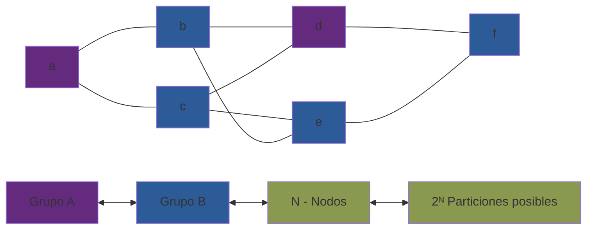

# Max-Cut + Ising + Simulated Annealing + 1 parámetro

Este proyecto tiene como objetivo:

> **Explorar cómo la temperatura inicial afecta la calidad de las soluciones al resolver Max-Cut mediante un solver estocástico tipo Ising.**

## Estructura general

**Pregunta foco**
>_¿Cómo influye la temperatura inicial en la capacidad del sistema para encontrar buenas soluciones?_
## Problema 
En esta sección se busca construir y entender el problema del proyecto, para lo cual se buscará responder la pregunta _¿Qué problema se está estudiando realmente?_
Para este proyecto se estudiará **Max-Cut**, el cual es un problema de optimización combinatorio NP-Hard, sin embargo conceptualmente ese no es el foco principal, se escogió porque se trata de un ejemplo mínimo de un problema NP-Hard que puede formularse como un paisaje de energía, algo así como mi "Hello, World!" o mi "Oscilador Armónico" de este campo. 

Intuitivamente este problema lo podemos entender teniendo un grafo (nodos conectados por aristas), donde cada una de sus aristas tiene un peso (qué tan importante es esta), la tarea que se tiene es que se quiere dividir a este grafo en dos grupos de tal forma que la suma de los pesos de las aristas que cruzan entre los grupos sea máxima. Las reglas son que las aristas que conectan nodos del mismo grupo no cuentan y las que cruzan de un grupo a otro si. 

_Ejemplo de un grafo y una de sus posibles configuraciones_

