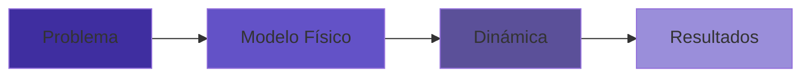

# Max-Cut + Ising + Simulated Annealing + 1 parámetro

Este proyecto tiene como objetivo:

> **Explorar cómo la temperatura inicial afecta la calidad de las soluciones al resolver Max-Cut mediante un solver estocástico tipo Ising.**

## Estructura general

