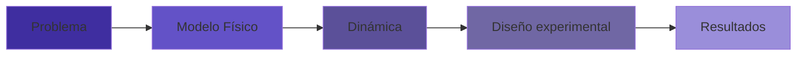
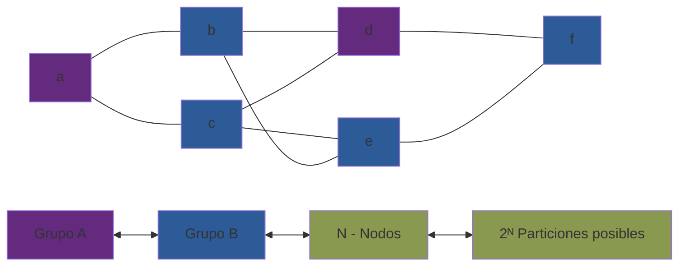
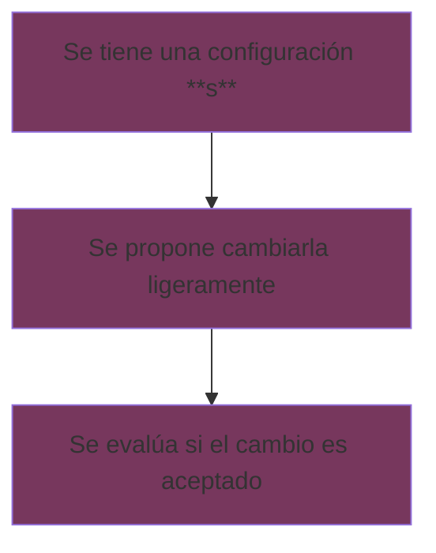
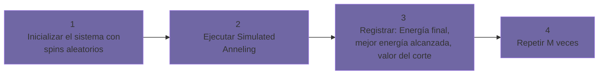
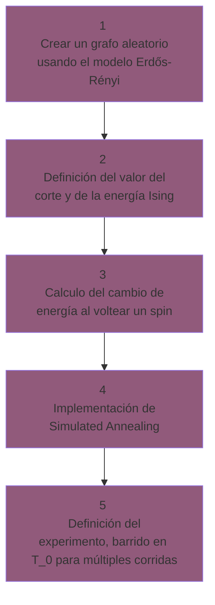

# Max-Cut + Ising + Simulated Annealing + 1 parámetro

Este proyecto tiene como objetivo:

> **Explorar cómo la temperatura inicial afecta la calidad de las soluciones al resolver Max-Cut mediante un solver estocástico tipo Ising.**

## Estructura general

**Pregunta foco**
>_¿Cómo influye la temperatura inicial en la capacidad del sistema para encontrar buenas soluciones?_
## Problema 
En esta sección se busca construir y entender el problema del proyecto, para lo cual se buscará responder la pregunta _¿Qué problema se está estudiando realmente?_
Para este proyecto se estudiará **Max-Cut**, el cual es un problema de optimización combinatorio NP-Hard, sin embargo conceptualmente ese no es el foco principal, se escogió porque se trata de un ejemplo mínimo de un problema NP-Hard que puede formularse como un paisaje de energía, algo así como mi "Hello, World!" o mi "Oscilador Armónico" de este campo. 

Intuitivamente este problema lo podemos entender teniendo un grafo (nodos conectados por aristas), donde cada una de sus aristas tiene un peso (qué tan importante es esta), la tarea que se tiene es que se quiere dividir a este grafo en dos grupos de tal forma que la suma de los pesos de las aristas que cruzan entre los grupos sea máxima. Las reglas son que las aristas que conectan nodos del mismo grupo no cuentan y las que cruzan de un grupo a otro si. 

_Ejemplo de un grafo y una de sus posibles configuraciones_

Otro punto importante es mencionar el enfoque que se le dará, en este caso en vez de pensar en dividir nodos, se visualiza como **la asignación de estados binarios a un sistema con interacciones**, en donde cada nodo es una variable binaria que recibe su estado, mientras que el sistema completo tiene una configuración y una energía asociada. Por lo que se buscará encontrar configuraciones de baja energía. 
Además no se busca un óptimo exacto, sino entender el comportamiento del solver, en general estudiarlo como un sistema físico explorando su espacio de estados. 

## Modelo Físico 
Definimos cada nodo como una varible física binaria (spin)

$$ s_i \in \{-1, 1\} $$

y una configuración del sistema como 

$$ \textbf{s} = (s_1, s_2 , ... , s_N)$$

por lo que una solución al problema es un estado físico del sistema.
Teniendo que la energía del sistema estará dada por:

$$ E(\textbf{s}) = \sum_{(i,j) \in E} J_{ij}s_is_j$$

por lo que:

- Si dos spines contectado son iguales contribuyen positivamente
- Si dos spines conectados son opuestos contribuyen negativamente 
- $J_{ii} < 0$ por lo que el sistema prefiere spines conectados de manera opuesta 
- Mínimizar la energía del sistema será equivalente a maximizar el corte. 

Cabe mencionar que se está usando un modelo de Ising sin campos externos y sin ninguna dependencia temporal en el Hamiltoniano. 

> **Nota importante:** Una vez formulado el problema como un sistema físico, la pregunta deja de ser “cómo encontrar la mejor partición” y se convierte en “cómo permitir que el sistema explore eficientemente su paisaje de energía”.

## Dinámica 
En esta sección se busca definir una regla de evolución que le diga al sistema cómo moverse en el paisaje de energía. En este caso **Simulated Annealing** está inspirado en un proceso físico reconocido de enfriar lentamente un material permitiendo que explore estados y se "congele" en un mínimo profundo. De manera general un paso en la dinámica se compone de:

Para este caso la **regla de aceptación** la define el **algoritmo de Metropolis**. 

Se tiene un spin $s_i$, se propone $s_i → -s_i$, además se tiene el cambio de energía dado por:

$$\Delta E = E_{new} - E_{old} $$

- Si $\Delta E < 0$ entonces se acepta 
- Si $\Delta E > 0$ entonces se acepta con la probabilidad
    
    $$P = \exp(-\Delta E / T)$$

en este caso el rol de la temperatura controla qué tan probable es aceptar movimientos "malos".
Analizando los casos límites

- $T → 0$: Solo se aceptan mejoras 
- $T → ∞$: Se aceptan casi todo, equivalente a un random walk

Además, para el enfriamiento se usará un Schedule lineal(la temperatura disminuye linealmente) ya que se está priorizando la claridad y este resulta suficiente 

$$ T(t) = T_0 - (T_0 - T_f)\dfrac{t}{N_{steps}}$$

es importante recordar que para este experimento se van a fijar el resto de los parámetros excepto justamente la $T_0$.

De esta manera podemos obtener las siguientes ideas principales:

- La dinámica estocástica permite explorar el paisaje de energía.
- La regla de Metropolis introduce aceptación probabilística.
- La temperatura controla el balance exploración–explotación.
- El enfriamiento progresivo favorece la convergencia.
- El comportamiento final depende críticamente de los parámetros.
- El solver es inherentemente probabilístico.

## Diseño experimental
En esta sección se busca responder a la pregunta base _¿Cómo cambia el comportamiento de un solver estocástico cuando se varía un parámetro físico?_ Por lo que vale la pena definir cuales serán los parámetros fijos en el experimento.

**Parámetros fijos**
- Grafo 
- Número de Nodos $N$
- Pesos de las aristas 
- Número de pasos del SA

**Parámetro variable**
- Temperatura inicial $T_0$

Para cada valor de $T_0$ 

El esquema anterior se plasmó en la siguiente estructura de código dentro del notebook `main.ipynb`.

